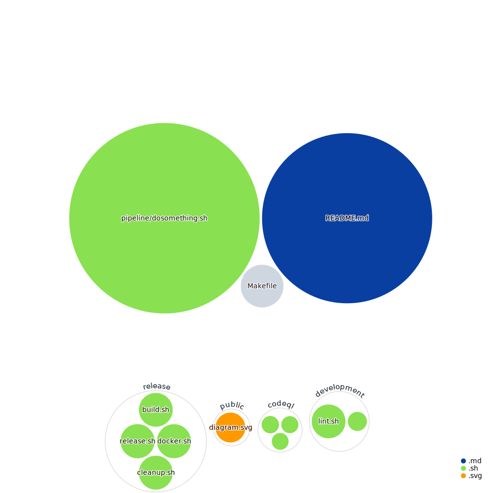

# github-actions-pipeline-playground

This repository is a playground to play with the possibilities of
github action workflows and building a deployment pipeline on top
of it.

Inspired by this article on the github blog:
[https://github.blog/2022-02-02-build-ci-cd-pipeline-github-actions-four-steps/](https://github.blog/2022-02-02-build-ci-cd-pipeline-github-actions-four-steps/)

## Workflow Status Badges
* 
* 
* 
* 
* 

## How to use this repo

The most interesting Workflow is the release Workflow - see [Actions · bkleinen/github-actions-pipeline-playground](https://github.com/bkleinen/github-actions-pipeline-playground/actions/workflows/release.yml)
The "Semantic Release" job depends on four other jobs, 2 of them in development.yml
It represents the deployment pipeline with 
- release.yml is triggered by push on master
- development.yml is triggered by push in PR, and used in release.yml
- CodeQL runs quietly for all pushes but is not a precondition in the deployment pipeline.

## Look further into this approach of creating a release:

* [open-sauced/semantic-release-conventional-config: semantic-release shareable config to publish to npm and/or ghcr](https://github.com/open-sauced/semantic-release-conventional-config)

## Reuse Docker Container
* check out the original version of the release.yml for storing and reusing docker images:
 [open-sauced/release.yml at main · aaronwinston/open-sauced](https://github.com/aaronwinston/open-sauced/blob/main/.github/workflows/release.yml)

## Links to Documentation used for this Project
* [GitHub Actions Documentation - GitHub Docs](https://docs.github.com/en/actions)
* [Workflow commands for GitHub Actions - GitHub Docs](https://docs.github.com/en/actions/using-workflows/workflow-commands-for-github-actions)
* [Reusing workflows - GitHub Docs](https://docs.github.com/en/actions/using-workflows/reusing-workflows#calling-a-reusable-workflow)

Pass values between workflows:
* [Reusing workflows - GitHub Docs](https://docs.github.com/en/actions/using-workflows/reusing-workflows#example-reusable-workflow)

## Diagram created in the Release Workflow:

